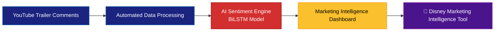

# Real-Time Sentiment Analysis of YouTube Movie Trailer Comments

## Project Overview
When a major studio drops a trailer, the marketing team has only hours, not days, to understand audience reactions. Manually scanning thousands of YouTube comments is not practical. This project solves that problem.

It delivers a marketing intelligence dashboard powered by a Bidirectional LSTM model that analyses real-time sentiment from YouTube trailer comments. Designed with a real business use case, it enables film studios to instantly assess audience response on release day without reading comments manually.

We built a system that:
1. **Scrapes** YouTube trailer comments via the YouTube API
2. **Preprocesses** raw social media text using an NLP pipeline
3. **Labels** comments automatically using VADER sentiment analysis
4. **Trains** three deep learning models (SimpleRNN, LSTM, BiLSTM) and selects the best
5. **Deploys** the winning model inside a Streamlit marketing intelligence dashboard

---

## 🏆 Results at a Glance

| Model | Test Accuracy | Macro F1 |
|-------|:---:|:---:|
| Simple RNN | 39.18% | 0.19 |
| LSTM | 81.57% | 0.81 |
| **BiLSTM** | **81.87%** | **0.81** |

The **BiLSTM was selected** as the final production model for its superior negative class detection, critical in a marketing context where missing negative sentiment can lead to poor campaign decisions.

## 📁 Project Structure

```
├── data_scraping.ipynb          # YouTube comment collection
├── data_preprocessing.ipynb     # Data preprocessing and labeling
├── model_training.ipynb         # RNN, LSTM, BiLSTM training & evaluation
├── app.py                       # Dashboard
├── sentiment_bilstm_model.keras # Trained BiLSTM model weights
├── tokenizer.pkl                # Saved tokenizer
├── data/
│   ├── youtube_comments.csv     # scraped comments (66,803)
│   └── preprocessed_youtube_comments.csv
└── README.md
```

---

## Workflow

---

## 🔧 Setup & Installation

### Prerequisites
- Python 3.8+
- A YouTube Data API v3 key ([Get one here](https://console.cloud.google.com/))

### Install Dependencies

```bash
pip install tensorflow keras nltk streamlit google-api-python-client \
            vaderSentiment pandas numpy scikit-learn matplotlib seaborn
```

### Download NLTK Resources

```python
import nltk
nltk.download('stopwords')
nltk.download('wordnet')
```

---

## 🚀 Running the Project

### Step 1 - Scrape Comments

Open `data_scraping.ipynb` and set your API key:

```python
API_KEY = "your_youtube_api_key_here"
```

Run all cells. This will generate `youtube_comments.csv` with comments scraped from 9 trailer queries.

### Step 2 - Preprocess & Label

Open and run `data_preprocessing.ipynb`. This applies the full NLP pipeline and generates `preprocessed_youtube_comments.csv` with VADER sentiment labels.

### Step 3 - Train Models

Open and run `model_training.ipynb`. All three models (RNN, LSTM, BiLSTM) will be trained, evaluated, and compared. The best model is saved automatically.

### Step 4 - Launch the Dashboard

```bash
streamlit run app.py
```
---

## 📊 Dataset

| Property | Value |
|----------|-------|
| Total comments scraped | 66,803 |
| After cleaning | 64,208 |
| Positive labels | 25,190 |
| Neutral labels | 23,508 |
| Negative labels | 15,510 |

**Queries used:** Avengers Endgame, Fast & Furious 7, Interstellar, Oppenheimer, Game of Thrones, Breaking Bad, Peaky Blinders, Stranger Things, Squid Game

---

## 🏰 Disney Marketing Intelligence Dashboard
The dashboard provides two tabs:

- **Tab 1 - Real-Time Trailer Analysis**
- **Tab 2 - Individual Comment Check**

### Features
- **YouTube Link Integration:** Paste any trailer URL to fetch live comments.
- **10 Strategic Metrics:** Sentiment Index, Brand Advocacy, Critical Friction, Audience Polarisation, and more.
- **Interactive Visualizations:** Recency-weighted sentiment trends, distribution charts, and **real-time Word Clouds**.
- **Video Context:** Integrated metadata (Views, Likes, Channel) for deeper performance benchmarking.
- **Individual Comment Tester:** Real-time probability breakdown for specific audience feedback.

---

## 📜 License
This project is licensed under the **MIT License** - see the [LICENSE](LICENSE) file for details.

*This project was developed for the Deep Learning assessment.*